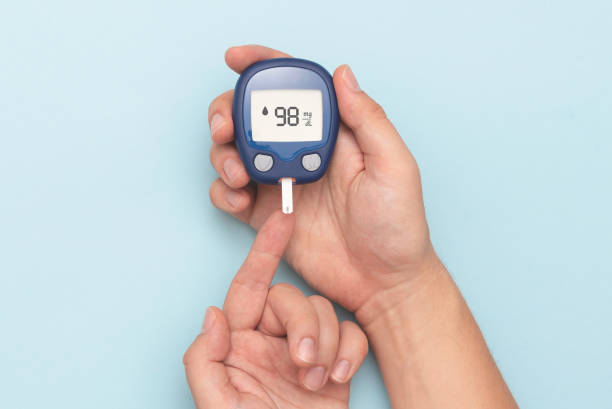

# Diabetes Management Application




The Diabetes Management Application is a web-based tool developed using Python Flask, MySQL, JavaScript, HTML, and CSS. This application is designed to assist users in monitoring their blood sugar levels, connecting them with nearby doctors specializing in diabetes care, and offering recommendations to manage and reduce high sugar levels.

## Features

- **Blood Sugar Level Monitoring:** Users can regularly log their blood sugar levels and track their progress over time. The application provides visualizations to help users understand their data trends.

- **Doctor Referral:** The application offers a feature to locate and refer users to the nearest doctors who specialize in diabetes management. Users can find doctors in their area based on their location.

- **Recommendations and Tips:** The application provides personalized recommendations and tips to help users lower their blood sugar levels through lifestyle changes, dietary adjustments, and exercise.

## Prerequisites

Before setting up and running the Diabetes Management Application, ensure you have the following components installed:

- Python (3.6 or higher)
- Flask (Python web framework)
- MySQL Server
- JavaScript-enabled web browser

## Setup Instructions

1. Clone the repository:

   ```bash
   git clone https://github.com/cboychinedu/DiabetiesWebApp
   ```

2. Navigate to the project directory:

   ```bash
   cd DiabetiesWebApp
   ```

3. Install Python dependencies:

   ```bash
   pip install -r requirements.txt
   ```

4. Configure MySQL:

   - Create a MySQL database for the application.
   - Update the `config.py` file with your database credentials.

5. Initialize the database:

   ```bash
   python manage.py db init
   python manage.py db migrate
   python manage.py db upgrade
   ```

6. Run the application:

   ```bash
   flask run
   ```

7. Access the application in your web browser:

   ```http
   http://localhost:5000
   ```

## Screenshots

## Contributing

Contributions to the Diabetes Management Application are welcome! If you find any issues or have suggestions for improvements, please open an issue or submit a pull request on the GitHub repository.

## License

This project is licensed under the MIT License - see the [LICENSE](/LICENSE) file for details.

## Contact

For any inquiries or support, please contact the development team at contact@diabetesapp.com.

---
